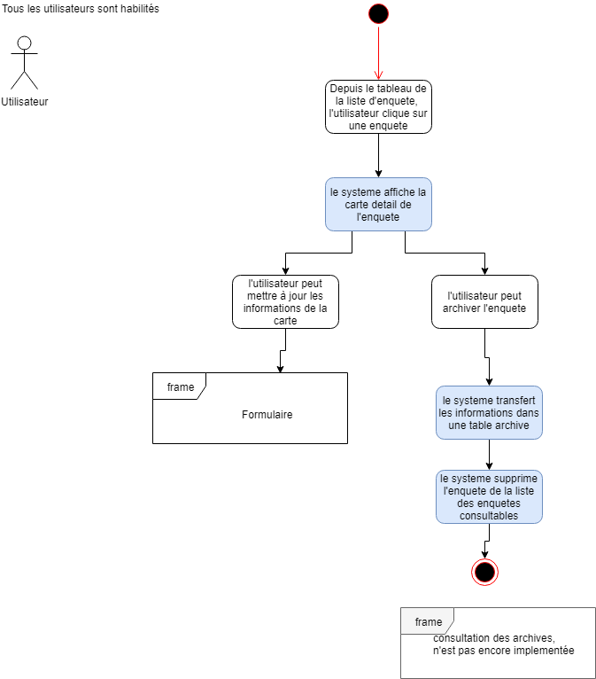
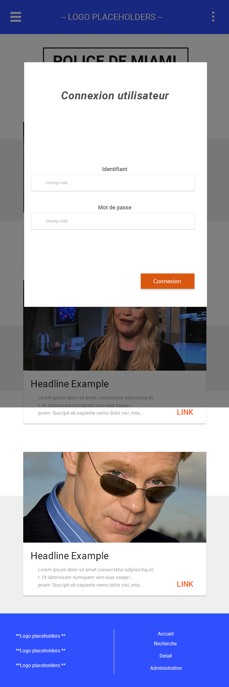
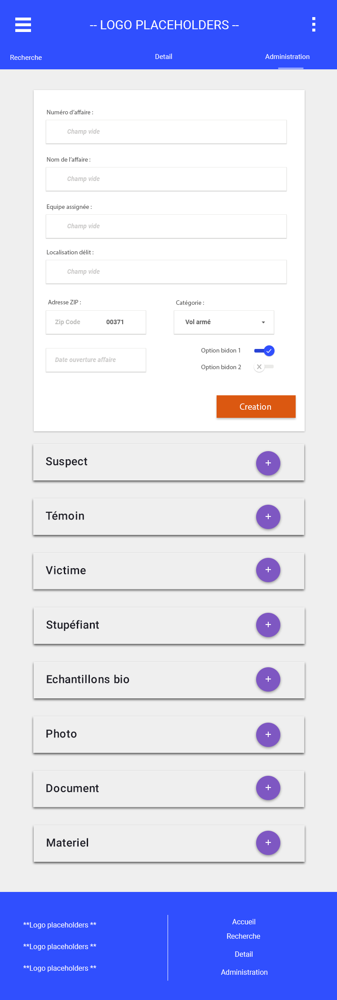
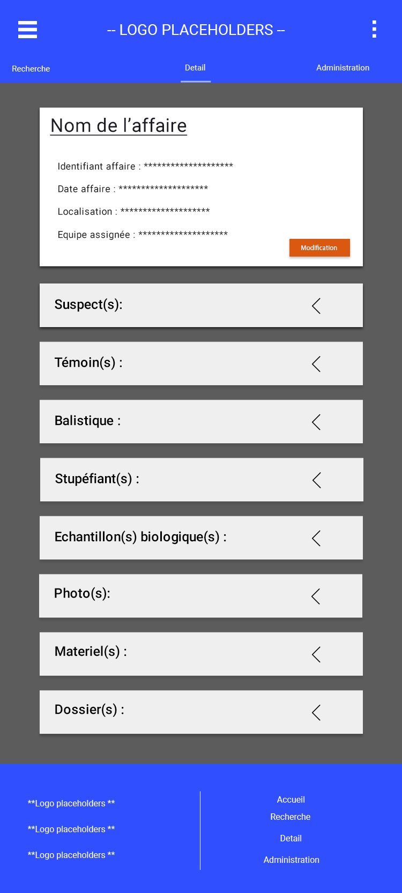
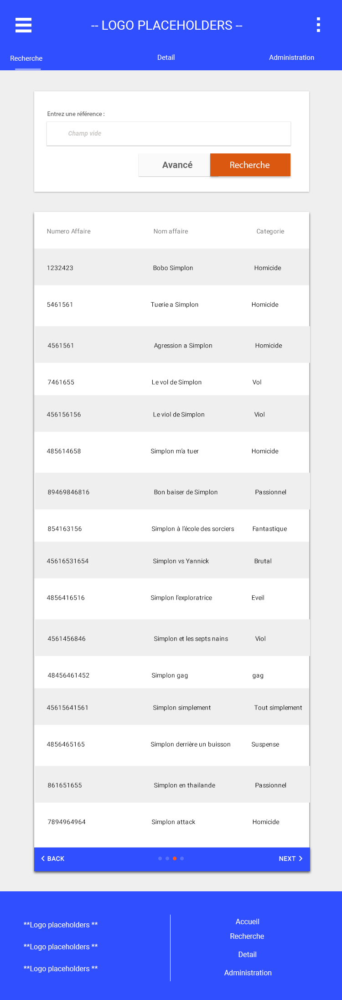
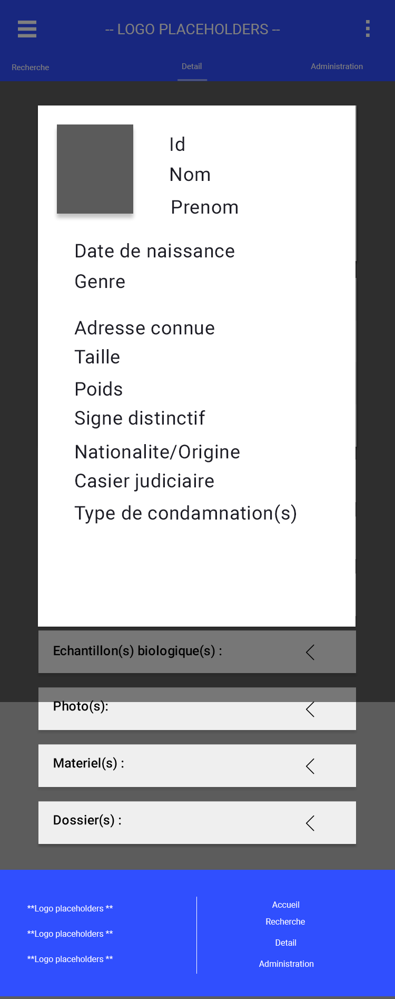
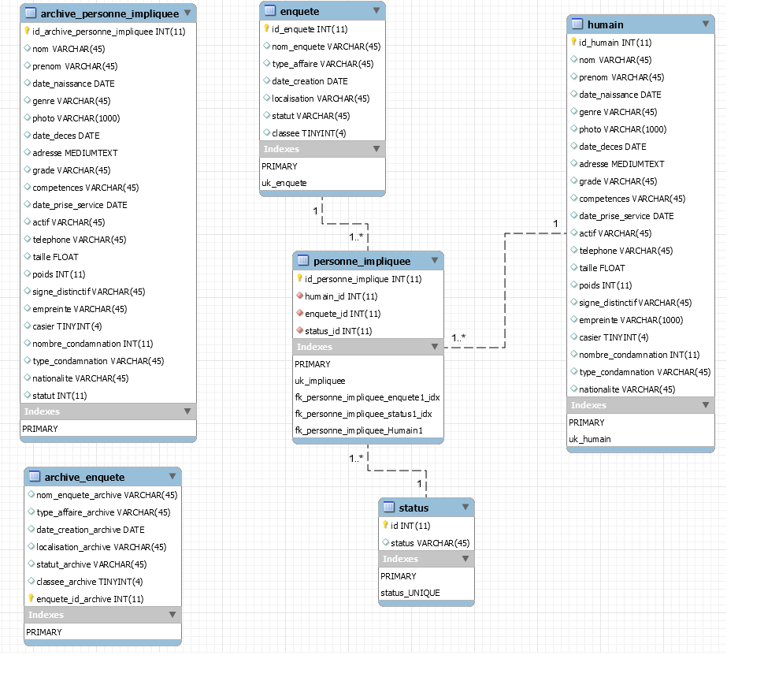

# Projet Csi miami
### Toutes les images présentes ainsi que d'autres support qui ont permit le developpement du projet sont disponibles dans le dossier Document du projet

A l'attention du client
## MODE OPÉRATOIRE

### Prérequis (Back)
- Java 1,8
- Maven (+ commandes exécuter/déployer)

- SGBDR MySQL
- filRougeSchemaDB.mwb ( genere le schema workbench de la base de données)
- scriptDatabase.sql
- requetesInsertionDonnées.sql (obtention des données)

#### Modifications nécessaires (Java : /CSI-Back/src/main/resources/application.properties)
- spring.datasource.url=jdbc:mysql :
- spring.datasource.username
- spring.datasource.password

- Si besoin de changer le port du serveur Tomcat,  ajouter la ligne : 
server.port: XXXX

### Prérequis (Front)
- NodeJS

### Lancement

#### Back
Via GitHub :
1. Cloner le repository
2. Ajouter le projet à votre IDE 
3. Faire un ```MVN Clean Install```
4. Faire un Maven Update Project
5. Lancer l’application via : Run as Spring Boot App

Via le fichier jar:
1. Ouvrir une invite de commande dans le dossier contenant le fichier jar
2. Entrer : ```java -jar Csiback-0.0.1-SNAPSHOT.jar```

#### Front
1. Cloner le repository
2. cd 
3. ```npm install```
4. ```npm install -g @angular/cli```
5. ```ng serve -o```
6. ```ng build``` (créer le dist/ avec l’index html)

## DIAGRAMMES

### USECASE

- USECASE DE L’APPLICATION


-DIAGRAMME DE PACKAGE DE FONCTIONNALITES


### DIAGRAMMES D’ACTIVITE

- CREATION DE SUSPECT


- CREATION D'UNE AFFAIRE


- AJOUT D'UN SUSPECT DANS UNE AFFAIRE


- CONSULTATION DE LA FICHE D'UNE ENQUETE




### DIAGRAMME DE CLASSES


### MOCKUPS

- PAGE DE CONNEXION



- PAGE DE L’ADMINISTRATEUR



- PAGES DES ENQUETES



- CONSULTATION DES AFFAIRES



- FICHE SUSPECT



### SCHEMA SQL
Document/schemaDB.png


### SCRIPTS SQL
- Document/filRougeSchemaDB.mwb
- Rappel : Pour l’obtention des données, le fichier “requetesInsertionDonnées.sql” est nécessaire et bien présent dans le projet (/Fil_Rouge/src/main/resources/data.sql)

###GENERATION DU FICHIER Csiback-0.0.1-SNAPSHOT.jar
 pour génerer le fichier .jar executable sur une autre machine :
 - on se place dans le dossier du projet (CSI-Back) 
 - on ouvre un invité de commande à cet emplacement
 -on tape la commande mvn package ( si le serveur du projet est lancé) ou mvn pacakge -DskipTests (si le serveur du projet n'est pas lancé le build ne se fera pas)
 -le fichier Csiback-0.0.1-SNAPSHOT.jar est génerer dans le dossier target


